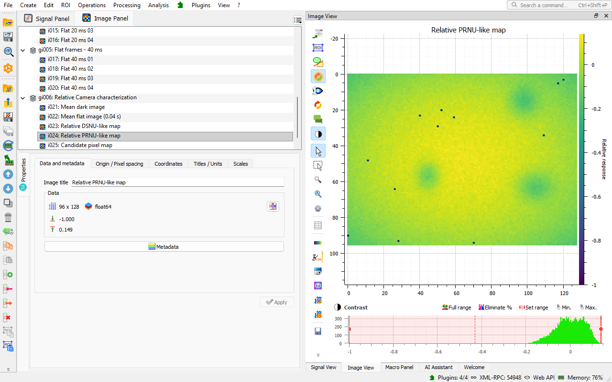
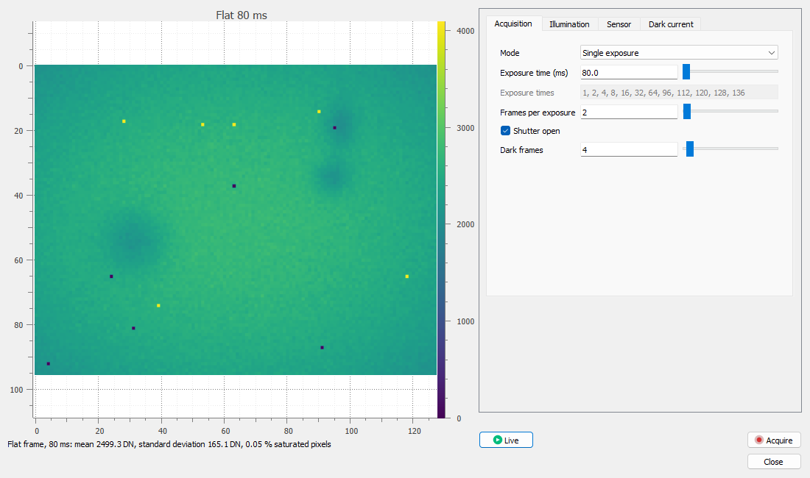

# Camera & Detector Characterization

A [DataLab](https://datalab-platform.com/) plugin to characterize scientific cameras and detectors: response, noise, conversion gain, dark current and defective pixels.



> **Status: Alpha.** The methods are validated on synthetic data with known truth. They do not claim EMVA 1288 compliance.

## Methods

Each method comes with a demonstration campaign.

| Method | Question | Guide |
| --- | --- | --- |
| Relative camera characterization | How do response, temporal noise and spatial non-uniformity behave, in DN? | [Relative characterization](doc/relative-dn.md) |
| Photon transfer curve | What are the conversion gain (e⁻/DN), read noise, saturation capacity and dynamic range? | [Photon transfer](doc/photon-transfer.md) |
| Dark current and hot pixels | How much dark current does each pixel generate, and which pixels are hot? | [Dark current](doc/dark-current.md) |

## Installation

- **DataLab Desktop:** the plugin needs DataLab 1.4 or later (not released yet). Download the wheel (`.whl`) attached to the latest [release](https://github.com/DataLab-Platform/datalab-camera-characterization/releases) and install it with **Plugins > Configure plugins... > Install plugins**. This also works with the standalone version of DataLab. In a Python environment, you may instead install it with pip:

  ```bash
  pip install git+https://github.com/DataLab-Platform/datalab-camera-characterization.git
  ```

- **DataLab-Web:** [DataLab-Web](https://github.com/DataLab-Platform/web) bundles the plugin. There is nothing to install.

## First Run

1. In the image panel, choose **Plugins > Camera & Detector Characterization > Open quickstart example**.
2. Choose **Run camera characterization...** in the same menu.
3. Accept the parameters.

DataLab adds a response curve with its metrics table, spatial maps, profiles and distributions. The **Applications** catalog, opened from the welcome page, offers the same path in one click. See [Getting started](doc/getting-started.md).

## Camera Simulator

The **Scientific camera simulator** shows a live view of a synthetic camera next to its settings. It acquires dark and flat frames ready for the methods. See [Camera simulator](doc/simulator.md).



## Documentation

- [Documentation index](doc/README.md)
- [Contributing](CONTRIBUTING.md)
- [Changelog](CHANGELOG.md)

## License

BSD 3-Clause, see [LICENSE](LICENSE).
